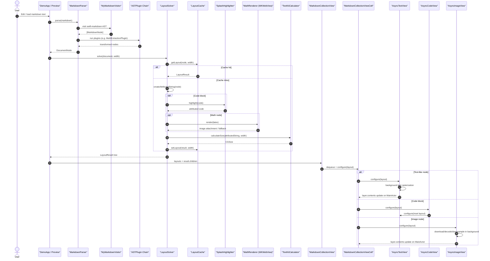

# Rendering Pipeline Sequence

This sequence shows the end-to-end flow from markdown input to on-screen virtualized rendering.

## Notes

- Sizing is expected to be O(1) at collection-view query time because dimensions are precomputed.
- Heavy work is intentionally shifted to background tasks, with only final layer/content mounting on main thread.
- Theme/appearance changes should trigger layout refresh so cached attributed output matches current colors.

